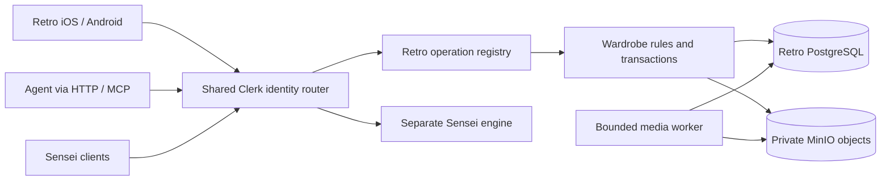

# Retro wardrobe engine

Design and implementation notes — 2026-10-08. **Retro owns wardrobe; [Sensei](sensei.md) owns productivity.**
The Go/PostgreSQL backend and MinIO photo pipeline are implemented in [engine/](../engine/README.md).
The generated [OpenAPI contract](../engine/api/openapi.json) describes implemented requests/results.
Router/Helm wiring is present in `agent-harness`; deployment and final verification are deferred at the owner's request.
Native M1–M6 integration and the focused wardrobe shell are in source. P1–P3.3 extend the shared registry to 46
operations, including settings/care/feedback, daily selections/pairings, daily automation and manual laundry. Source progress and
limits are tracked in the [implementation phases](retro-implementation-phases.md). P3.4 reuses existing operations
for reviewed native Apple/agent laundry timing/batches. Sensei extraction remains future work.

## Outcome and architecture

Add the clothes you own, choose from available clothes, confirm what you wore and look back without history changing
when inventory changes. Manual capture works without AI. Confirming an outfit takes one explicit action.

Run one `retro-engine` per workspace, with its own PostgreSQL database and private MinIO bucket, behind `/retro`.
The router authenticates and chooses the workspace. The engine serves one wardrobe and has no Clerk configuration,
identity-header requirements or multi-tenant query partitioning.
Follow the sibling Finance engine's Go service structure and shared operation registry for HTTP/MCP.
There are no goals, habits, tasks, journal entries or productivity-day tables in Retro.
Sensei gets a separate engine/database; cross-reads are optional later work.



Start with one service binary, PostgreSQL and private object storage. Durable media jobs live in PostgreSQL and a
bounded worker runs in the same binary. No Redis, separate AI service or vector database initially. SQL handles
search and wear summaries; do not inherit Finance's TimescaleDB/pgvector requirements without a domain need.

## Reference and improvements

[Wardrowbe's overview](https://github.com/Anyesh/wardrowbe/tree/1f6f6f49150dc2cc4fe6d0b28460213e9d461e52#features)
offers photo tagging, contextual recommendations, wear history/feedback and analytics. These are useful directions.
Household sharing remains outside the first release. The owner's expanded scope adds scheduled connected delivery in P2.5.

| Source reviewed | Retro design choice |
| --- | --- |
| [Item model](https://github.com/Anyesh/wardrowbe/blob/1f6f6f49150dc2cc4fe6d0b28460213e9d461e52/backend/app/models/item.py): images, attributes, wear/wash metadata, processing state | Separate garment availability from image/AI processing so failure cannot disable manual use |
| [Recommendation service](https://github.com/Anyesh/wardrowbe/blob/1f6f6f49150dc2cc4fe6d0b28460213e9d461e52/backend/app/services/recommendation_service.py): candidate filtering and model-to-inventory mapping | Explicit eligibility/composition rules; validate every selected ID and required piece before saving |
| [Outfit model](https://github.com/Anyesh/wardrowbe/blob/1f6f6f49150dc2cc4fe6d0b28460213e9d461e52/backend/app/models/outfit.py): suggestions and feedback | Distinguish a transient suggestion, a dated plan and an actual wear |
| [Tagging durability tests](https://github.com/Anyesh/wardrowbe/blob/1f6f6f49150dc2cc4fe6d0b28460213e9d461e52/backend/tests/test_tagging_durability.py): enqueue ordering, retries and stale work | Transactional job intent in PostgreSQL and fencing for expired worker attempts |

Reviewed commit: `1f6f6f49150dc2cc4fe6d0b28460213e9d461e52`. This is feature/design research, not a complete audit.
No reference code is copied. The improvements below address Retro's needs rather than claiming reference defects.

## First wardrobe release

| Action | Result |
| --- | --- |
| Add a garment with an optional photo | Stable inventory ID immediately; photo upload/processing is separate |
| Browse inventory/detail | Searchable metadata, explicit availability and confirmed wear statistics |
| Ask what to wear or anchor on a piece | Up to three distinct eligible combinations with factual reasons |
| Save for a date | Planned outfit; no wear count change |
| Tap Wear, with changes if needed | Record the actual garment IDs, never infer wear from viewing/accepting a suggestion |
| Change clothes later | Second outfit on the same date, preserving the first |
| Correct or remove a mistaken wear | Versioned, audited correction; statistics follow corrected history |
| Mark clothes washing/unavailable | Exclude from suggestions; do not infer dirty state from wearing |
| Archive an item | Remove from active inventory/suggestions, preserve historical outfits |

Proposed native navigation: **Today** (dressing decision), **Wardrobe**, **History**, account/settings.
Add opens garment capture; productivity Capture moves to Sensei. Names and accessible descriptions accompany photos.
The focused shells, manual writes, durable private photo flows and optional local iOS capture assistance are implemented in source; suggestions/insights and later assistance remain pending.
The combined demos are preserved for Sensei; the new shells have not been built/tested.

## Records and invariants

UUIDs identify entities and integer versions begin at 1. Ordinary UUID foreign keys connect records in the
instance's one database. Timestamps are UTC instants. Outfit `day` is a local `YYYY-MM-DD` date with a saved IANA `time_zone`.
Travel or changing the default timezone never silently shifts past outfits.

| Table | Central fields |
| --- | --- |
| `garments` | ID, version, name, category, availability, metadata, timestamps, nullable archive time |
| `garment_media` | Garment/media IDs and order; first image is primary |
| `media` | ID, declared SHA-256/size, state, immutable object references, dimensions, safe error, timestamps |
| `outfits` | ID, version, day/timezone, state (`planned`, `worn`, `void`), label/occasion/notes, source, confirmation time, previous state for undo |
| `outfit_items` | Outfit/garment IDs, position, chosen role, metadata/photo snapshot when confirmed |
| `outfit_media` | Media references retained by the current confirmed snapshot |
| `day_selections` | Stable ID/local date, version, nullable selected outfit, captured time zone and update time; explicit clear retains the row |
| `pairings`, `pairing_items` | Named reusable combinations, version/archive state and ordered real garment references; presentation reads current garment facts |
| `daily_settings` | Versioned desired daily mode/time/zone and optional connected delivery target; Temporal status is separate |
| `daily_runs` | One immutable ranked snapshot per date/zone, settings version/expiry and nullable claim/agent-recorded receipt |
| `laundry_loads`, `laundry_items` | Versioned dated plans/programme, confirmed progress timestamps, immutable reviewed care/garment snapshots and exclusive active-garment reservation |
| `changes` | Entity, operation, router/worker actor, before/after, timestamp; append-only audit |
| `requests` | Key, operation, normalized input hash, original successful result |
| `media_jobs` | Media ID, attempt, lease token/expiry, next attempt, done flag; checksum/error live on media |

Garment optional attributes: subtype, colours, warmth (`light`, `mid`, `warm`, unknown), season tags, formality,
material, brand, notes and favourite. Unknown remains unknown. Clothing colour names/swatches are independent of
the demo UI's eight palette tones. Purchase accounting/cost-per-wear is deferred; later amounts need a currency.

Categories: `top`, `bottom`, `one_piece`, `outerwear`, `footwear`, `accessory`, `other`. Composition roles are separate:
a tee and sweater may both be tops but occupy base/mid layers. Support dresses, layered tops and multiple accessories;
the demo's one-item-per-slot restriction is not a database rule. Unknown/other pieces remain manually usable.

Availability is `ready`, `needs_wash`, `washing`, `unavailable`, independent of archival or photo processing.
It is explicitly versioned and audited. P3.1 records confirmed wash/dry completion and P3.3 derives wears since the
latest completed cleaning from current confirmed history, without a mutable counter. Same-day timing remains
uncertain and missing baselines unknown. Optional per-garment review thresholds are owner preferences; they never
infer dirtiness or change availability. Changing availability alone does not establish cleaning or rewrite outfits.

An outfit has 1–30 unique existing garment IDs in presentation order. Multiple outfits can share a date.
New plans require active garments. Manual historical wears may include archived garments and incomplete combinations.
Current unavailability does not reject historical truth; native warning presentation is pending. Future dates can be planned but not
confirmed worn relative to the saved timezone. Voiding preserves the date, items, audit and previous state;
explicit restore reinstates that state with normal write validation.

Confirmation snapshots item names, category, colours and immutable photo references. Later renaming or photo
replacement cannot rewrite a confirmed outfit. Explicit correction of a worn outfit replaces its current snapshot
and keeps prior values in the audit. Archive never detaches historical references.

Statistics derive from non-void worn outfits: `wear_days` counts distinct dates, `wear_events` counts outfits,
`last_worn_on` is the latest date. Two outfits sharing shoes on one date mean one wear day and two wear events.
The UI labels `wear_days` as "days worn". Plans, retries, corrections and void/restore cannot drift stored counters.
`wardrobe_day_get` groups outfit rows in one consistent read; missing dates return an empty collection.
No shared productivity `days` table or cross-engine transaction is needed.

## Shared operation contract

Follow [Finance's operation conventions](../../finance-engine/docs/operations.md), with wardrobe-specific rules.
HTTP is `POST https://harness-router.nighthawklabs.org/retro/api/v1/operations/<name>` with snake_case JSON.
Private engine paths omit `/retro`. `/mcp` exposes identical names, inputs/results and domain rules.
Capabilities and OpenAPI are generated from the registry; read operations also use POST.

| Operations | Semantics |
| --- | --- |
| `preferences_get`, `preferences_update` | Shared wardrobe settings and machine presets; versioned partial edits and native save/recovery; eligible-candidate ranking uses preferences in P2.1 |
| `outfits_feedback_get`, `outfits_feedback_update` | Explicit worn-outfit feedback; separate stable identity/version, outfit-version review, reset/correction/audit |
| `wardrobe_context_get` | Bounded explicit-record context with source IDs/versions/freshness, coverage and wardrobe capabilities; no remote jobs |
| `wardrobe_daily_settings_get`, `wardrobe_daily_settings_update` | Separate versioned daily automation settings; ordinary partial-patch/audit, no wake creation on save |
| `wardrobe_daily_get`, `wardrobe_daily_generate` | Read or generate one cached ranked snapshot per date/zone, current settings version and bounded local window; no plan/wear |
| `wardrobe_daily_delivery_claim`, `wardrobe_daily_delivery_complete` | One authorized external send reservation and agent-recorded receipt; no engine notifier or automatic uncertain resend |
| `laundry_preview` | Bounded active-needs-wash grouping by explicit programme and confirmed care; unknown/incompatible items retain reasons |
| `laundry_create`, `laundry_get`, `laundry_list`, `laundry_update` | Editable compatible planned loads with source versions and retained care snapshots; paginated state/garment history |
| `laundry_progress`, `laundry_cancel` | Versioned next-step confirmations, exclusive active pieces, ready only after dry/return confirmation; cancellation retains history and returns active pieces to needs wash |
| `garments_create` | Optional client UUID, name/category and optional attributes; image not required |
| `garments_get`, `garments_list` | Record or filtered inventory, including derived wear stats |
| `garments_update` | Partial patch, including availability, reviewed care and ordered ready media IDs; omitted retains, null clears nullable fields |
| `garments_archive`, `garments_restore` | Versioned lifecycle; restore retains availability |
| `outfits_create` | Optional client UUID, day/timezone/items, explicit planned or worn state |
| `outfits_get`, `outfits_list` | Historical snapshots for worn outfits, current inventory detail for plans; void outfits retain stored snapshots where present |
| `outfits_update` | Partial patch of date/items/context; state transitions use dedicated operations |
| `outfits_confirm` | Planned → worn with final selected items; revalidate and snapshot atomically |
| `outfits_void`, `outfits_restore` | Exclude from statistics or explicitly undo removal |
| `wardrobe_day_get` | Date's plans/wears, current garment presentation and stable daily selection; voids opt-in, selected void references remain visible with a problem |
| `wardrobe_day_selection_update` | Select an existing reviewed ready plan for its local day, or clear with a version check; never records wear |
| `pairings_create`, `pairings_get`, `pairings_list`, `pairings_update`, `pairings_archive`, `pairings_restore` | Reusable 2–30 garment combinations, current facts, garment-linked pagination, versioned edits/lifecycle and audit |
| `wardrobe_suggest` | Read-only preference/explicit-rating ranking with source/version and coverage; required/excluded IDs, occasion, explicit warmth, variant, excluded fingerprints, optional expected preference version and replacement role |
| `wardrobe_analyze` | Date-filtered outfit events/wear days, unworn inventory and current-category totals; lifetime last-worn is on garments |
| `history_list` | Wardrobe-scoped garment/outfit/media/preferences/feedback/pairing/day-selection/daily-settings/daily-run audit |
| `media_prepare`, `media_get`, `media_retry` | Reserve upload, inspect status/private content paths, retry failed processing |

All mutations require database-scoped `idempotency_key` (1–128 characters) across operations. Data, audit and the saved
result commit together. Same key and normalized input/operation returns the original result; reuse with changed input
returns `conflict`. Check committed retries before current versions. Failures roll back without reserving keys.
Daily delivery claims are the exception: replay returns the stored run with `send_allowed: false`, so a lost
grant does not authorize another external send. Provider retries still need deployed idempotency support.
Initially successful retry records do not expire. Client-generated UUIDs separately prevent duplicate creates with
a different key; an existing ID returns `duplicate` without overwriting.

Existing-record writes require `expected_version`. Ordinary outfit edits apply only to planned/worn records;
void records must first be explicitly restored. Serialize wardrobe writes with the Finance pattern's transaction
advisory lock. Outfit writes validate current garment existence/eligibility in that transaction. Long photo/provider
I/O happens outside the lock. Stale edits return `conflict` plus current version; refetch, reconcile and use a new key.
Updates cannot bypass dedicated lifecycle operations. Never silently last-write-wins user corrections.

Success is HTTP 200 with the result object. Errors are `{"error":{"code":"conflict","message":"…"}}`.
Codes: `invalid_input` 400, router authentication 401, `not_found` 404, `conflict`/`duplicate` 409, `too_large` 413,
`busy` 503, `internal` 500. MCP uses the same error with `isError`. Router `no_tenant` remains distinct from missing data.

Lists accept literal text, category, availability, archive/state, garment and date filters. Default limit 50, max 200.
Stable keyset cursors bind filters and sort; they are not sync tokens or an immutable multi-page snapshot.
Initially clients refresh queried views/inventory, with no change feed, bulk import or export API. JSON body limit
1 MiB; operation timeout 30 seconds. Generated schemas are included; shared native fixtures await client integration.

Example `outfits_create` input (IDs must reference existing garments):

```json
{
  "idempotency_key": "phone-wear-20261008-01",
  "id": "cccccccc-cccc-4ccc-8ccc-cccccccccccc",
  "day": "2026-10-08",
  "time_zone": "America/Los_Angeles",
  "state": "worn",
  "occasion": "casual",
  "items": [
    {"garment_id": "aaaaaaaa-aaaa-4aaa-8aaa-aaaaaaaaaaaa", "role": "base"},
    {"garment_id": "bbbbbbbb-bbbb-4bbb-8bbb-bbbbbbbbbbbb", "role": "bottom"}
  ]
}
```

Return an `outfit` object with ID, version, date/state and item snapshots. An identical retry returns the saved version
even after later corrections; refresh to display current data. A photo attachment is a separate garment-versioned edit.

## Private photographs and jobs

Confirmed storage: engine-managed private MinIO objects, metadata in PostgreSQL. The tenant chart deploys a standalone MinIO dependency
with a 10 GB PVC, private bucket and scoped application user. It derives endpoint/credentials and reuses the bucket
declaration instead of requiring duplicate Retro values. Local non-Helm runs still use environment configuration. No arbitrary external image URLs or server-side fetching of
caller-provided URLs. See [configuration and deployment](../engine/README.md).

1. Native clients export JPEG/PNG (convert HEIC), normalize orientation and strip location EXIF. Keep an owner-scoped
   pending file until acknowledged. Camera capture can create a garment before upload succeeds.
2. `media_prepare` reserves an ID/checksum/size/MIME and returns an authenticated upload path.
3. `PUT /retro/api/v1/media/<id>/content` streams bytes through the identity router. Enforce 12 MiB, magic bytes,
   checksum and claimed size. An identical retry is safe; different content cannot replace a reserved media ID.
4. Store source under an immutable media-ID/checksum content key, then commit processing state plus a job row. Object and
   database writes are not atomic: a retry verifies existing bytes and completes the DB step. Orphans are retained
   until a deliberate cleanup policy is implemented.
5. Worker enforces a 24-megapixel decoded limit, re-encodes to strip metadata, produces 1600px display/320px thumbnail
   variants and marks ready. Original source is retained and never served. Attach only ready media.
6. Authenticated `GET /retro/api/v1/media/<id>/content?variant=display|thumbnail` streams safe derivatives. MCP receives
   metadata/private paths; a path grants no access. Clients use authenticated image loading and per-owner caching.

Binary content is a transport exception; domain reserve/read/retry still uses operations. No base64 photos in JSON
or MCP, public buckets/CDN links, caller-supplied object paths or photo bodies in logs.
Each reserved media ID has separate immutable storage; no cross-record deduplication is implemented.
Historical snapshots keep old derivatives referenced after photo replacement.

Jobs use `FOR UPDATE SKIP LOCKED`, bounded leases/retries and attempt tokens. Work occurs outside the claim transaction;
only the current attempt can commit a result. One job row per media ID prevents duplicate active jobs.
Expired leases recover after restart. Failed processing is visible and retryable without disabling the garment.
Cleanup needs a defined retention period, no active lease and a fresh reference check. Claim a deleting state under
the same locking rules as attachment so a new reference cannot race object deletion. It cannot delete attached or
historically referenced derivatives. Choose/test retention before enabling cleanup; permanent purge is not in v1.

## Recommendations

First release uses deterministic rules, with no required model or weather-service dependency:

- Filter active, ready garments with supported roles. Required pieces must be eligible; return a reason when
  they cannot be used rather than silently dropping them.
- Compose top/bottom or one-piece bases with optional layers/accessories and footwear when available. Missing
  coverage gives an explicitly incomplete option; never invent a garment.
- Prefer suitable occasion/warmth when known, then less recently worn pieces and distinct combinations. Favourites
  break ties; stable UUID order makes results reproducible. Unknown context contributes no fabricated score.
- Use a variant index and excluded combination fingerprints for real Shuffle alternatives. Array reordering is
  not another outfit. Return up to three candidates or an explicit reason for no result.
- Return the requested day, IDs/versions, factual reasons, missing roles, fingerprints, generation time and
  algorithm version. They do not persist plans or increment wears. Save/confirm revalidates current inventory.

The [on-device intelligence plan](on-device-intelligence-plan.md) now schedules optional native garment drafts, OCR,
local cutout previews and outfit-request interpretation during client completion. These use existing operations;
they do not add backend inference. P1 explicit comfort/style feedback and P2.4 connected weather context are now
in source; external vision tagging and broader automatic forecast ranking remain later work.
Reuse existing agents through MCP for orchestration before building an in-engine provider framework. AI proposals
carry source/model, checksum and garment version. Review/apply is a separate versioned action; late results cannot
overwrite manual edits. Model-reported confidence is not a calibrated guarantee; fit/material may be unknowable.

The owner's expanded requirements are tracked in the [next-feature checklist](retro-feature-checklist.md): the app
will use a shared agent endpoint with access to user data/connections for daily suggestions, care/load planning,
capture enrichment and other orchestration. Live camera try-on is required, with rendering feasibility still pending.
These are future integrations/domain extensions; reuse this registry and keep authentication at the router.
Prefer on-device Foundation Models interpretation/explanation with read-only tools over this registry and bounded
agent-connected context. Native image/speech/tracking handles suitable local work; scheduled/heavier tasks use the
existing agent. Apple Private Cloud Compute is excluded; domain validation and durable saves stay in this engine.

Weather includes source, chosen location precision, observation/forecast time and freshness. Label stale/unknown
context and keep manual use available. Optional calendar/Sensei context supplies occasion/time windows without
copying tasks or journals. No IP geolocation fallback. Skipping is not automatically dislike; learn from explicit
feedback. P2.5 adds optional connected delivery with one authorized attempt and visible uncertain outcomes;
P3.1 adds manual wash/dry records with retained care snapshots and confirmed availability transitions.
P3.3 adds derived wears since completed cleaning and opt-in in-app wear-day/calendar-interval review reminders.
P3.4 adds source-bound Apple/agent proposals for compatible pieces and dates using bounded saved outfit needs,
with native refresh/review before applying to the existing load form. Provider-specific delivery guarantees/iPhone
push, sharing, virtual try-on, packing, laundry notification delivery, richer scheduling and cost-per-wear are deferred.

## Identity, offline and deployment

The shared router verifies Clerk and routes authorized callers to their workspace's private engine. The engine
ignores identity headers and serves its one wardrobe through HTTP, MCP and media routes. Each instance has a separate
DB role/database and private MinIO bucket. Restrict ingress to the router and explicitly trusted local MCP hub;
NetworkPolicy enforcement is required because direct engine requests have no authentication. Audit actors identify
router writes or the worker rather than users. Migration 0002 removes ownership partitions, preserves existing
photo paths and rejects a database containing multiple prior wardrobes instead of merging them.

Clients keep per-owner caches and durable pending-write queues. Persist IDs/intent/keys before sending; dispatched
payloads are frozen for identical retries. Order dependent creates/attachments and use returned versions. Never replay
account A's queue with B's token. Stop delivery and clear visible state on sign-out; isolate retained pending files.
Offline Wear is visibly pending until committed; conflict preserves intent for reconciliation. Cached inventory/history
remain readable; new remote suggestions/weather require connectivity. Demo data must never seed real accounts.

| Location | Status / remaining work |
| --- | --- |
| `retro/engine/` | Implemented Go service, migrations, registry/OpenAPI, MinIO jobs, container and tests; final verification deferred |
| Retro iOS/Android | M1–M3 implemented in source: reads/manual writes, durable photo upload/attachment, private images and optional local iOS OCR/cutout/text helpers; authored tests unrun; suggestions/insights and advanced recovery remain |
| `agent-harness/router` | Implemented tenant URL/port and authenticated `/retro/` forwarding for JSON, MCP and bytes; tests included but final verification deferred |
| `agent-harness/deploy/helm` | Implemented off-by-default `retroEngine` deployment/service/secret/network policy, DB role, MinIO dependency with 10 GB PVC/private bucket/scoped credentials, health/readiness |
| Tenant MCP config | Optional connection to the implemented `/retro/mcp`; private local hub needs no identity headers; not registered automatically |
| Sensei project | Separate native targets/registrations and productivity extraction from `sensei.md` |

Reuse shared idempotent onboarding. Existing completed workspaces get Retro via a chart upgrade, without rerunning
completed onboarding or rotating credentials. Completed workspace status alone does not prove Retro exists.
Distinguish missing workspace, missing engine and failed media storage. Verify router body limits/timeouts and binary
forwarding. Back up PostgreSQL and referenced images together; prove restore renders historical outfits.

## Build sequence and verification

1. **Facts first:** garments/archive, dated planned/worn/void outfits, versions, audit, idempotency,
   day/history reads, schemas and real native response fixtures.
2. **First usable release:** private photographs/jobs, availability, baseline suggestions/Shuffle, SQL wear summaries
   and offline native integration. This completes the wardrobe release described above.
3. **Intelligence:** reviewed tagging/cutouts, explicit weather/calendar context, feedback and ranking improvements.
   Publish capabilities only with implementation, not speculative endpoint stubs.
4. **Sensei extraction:** separate product work, not a prerequisite for the wardrobe backend.

Required checks: router authorization and private-ingress enforcement; concurrent same-key retries and lost responses; key misuse;
stale edits; multiple outfits/day; wear-day/event counts; date/timezone corrections; void/restore; archive/photo edits
preserving snapshots; incomplete composition and unavailable required pieces. Media checks cover malformed/oversized
images, checksum mismatch, duplicate upload, object/DB partial failure, worker restart/expired lease and cleanup races.
Native checks cover queued account switches, offline confirmation/reconciliation and shared response decoding.
Router checks cover spoofed identity and binary forwarding. A tested database/media restore gates release.

MinIO is selected and response schemas are generated. Before deployment, configure the pinned Retro image and use the chart's MinIO bucket/storage settings using the [deployment guide](../engine/README.md#deploy).
The owner will deploy before final verification. External photo AI stays off until deliberately configured with the
owner's permission. Audited past-outfit correction is implemented; Sensei's separate engine remains future work.
